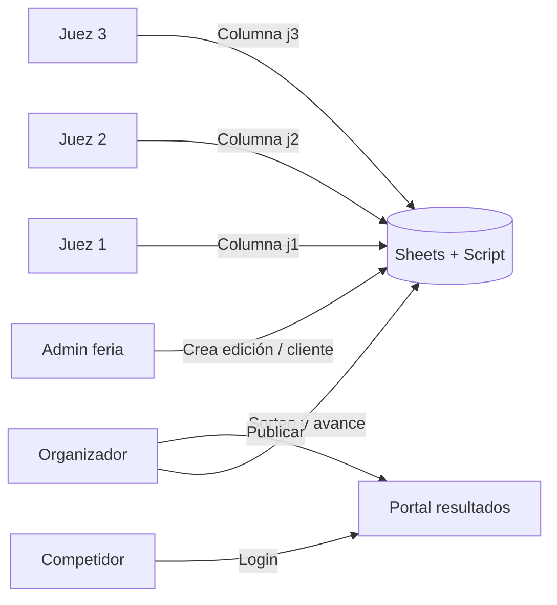
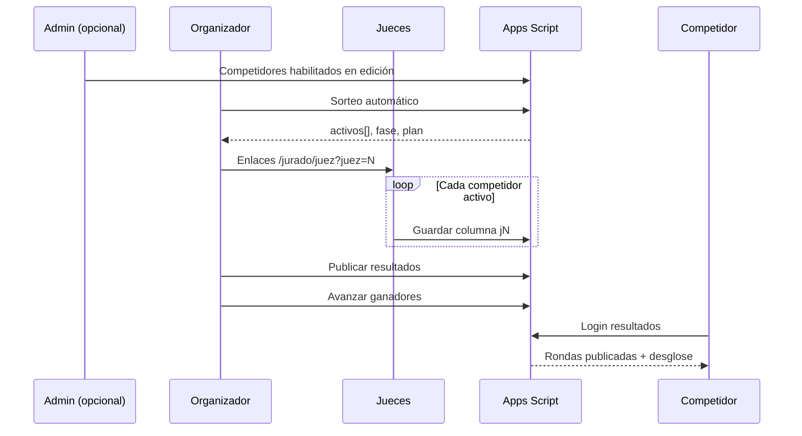

# Informe: Plataforma de calificación V60 y asignación de torneos

**Proyecto:** La Sucursal del Café — Feria de café especial  
**Sitio:** https://la-sucursal-del-cafe.web.app  
**Backend:** Google Apps Script + Google Sheets  
**Fecha del informe:** julio 2026  

Este documento explica, con diagramas anotados, cómo funciona la aplicación de **calificación de torneos** (jurado sensorial V60) y cómo se **asignan torneos y competidores** desde el panel administrativo.

---

## Índice

1. [Visión general](#1-visión-general)
2. [Roles y pantallas](#2-roles-y-pantallas)
3. [Panel administrativo — Competidores](#3-panel-administrativo--competidores)
4. [Asignación de torneos](#4-asignación-de-torneos)
5. [Calificación en vivo — Organizador](#5-calificación-en-vivo--organizador)
6. [Calificación en vivo — Juez](#6-calificación-en-vivo--juez)
7. [Portal de resultados del competidor](#7-portal-de-resultados-del-competidor)
8. [Modelo de puntaje](#8-modelo-de-puntaje)
9. [Fases del torneo](#9-fases-del-torneo)
10. [Backend y almacenamiento](#10-backend-y-almacenamiento)
11. [Flujo del día del evento](#11-flujo-del-día-del-evento)
12. [Referencias técnicas](#12-referencias-técnicas)

---

## 1. Visión general

La plataforma conecta cuatro actores: **administración de la feria**, **organizador del torneo**, **jueces sensoriales** y **competidores**. Los datos viven en Google Sheets (registro maestro) y en propiedades del script de Apps Script (puntajes en vivo y estado del bracket).


| Pieza | URL típica | Función |
|-------|------------|---------|
| Admin | `/admin` → Competidores | Ediciones, alta manual, clientes white-label, publicar |
| Inscripción feria | `/competencia` | Formulario público V60 Championship |
| Inscripción cliente | `/competencia/torneo?evt=slug` | Formulario white-label |
| Config torneo | `/jurado/config?evt=…&pin=…` | Cliente configura marca y reglas |
| Organizador | `/jurado/organizador?pin=…` | Día del evento: sorteo, rondas, publicar |
| Juez N | `/jurado/juez?pin=…&juez=N` | Calificación móvil por criterio |
| Resultados | `/jurado/resultados` | Competidor consulta con nombre + cédula |

**Regla clave:** los competidores **no ven** sus puntajes en el portal hasta que el organizador (o el admin) pulsa **«Publicar resultados a competidores»**.

---

## 2. Roles y pantallas



| Rol | Acceso | Qué puede hacer |
|-----|--------|-----------------|
| **Admin feria** | PIN admin + `/admin` | Gestionar hoja Competencia, crear torneos white-label, forzar publicación, ver accesos al portal |
| **Organizador** | `?pin=v60organizador` (o PIN del cliente) | Sorteo, control de fases, ver matriz de puntajes, publicar, avanzar ganadores |
| **Juez** | `?pin=v60sensorial&juez=N` | Calificar competidor activo; solo edita su columna |
| **Competidor** | Nombre + cédula en `/jurado/resultados` | Ver **solo** sus rondas **publicadas** |

---

## 3. Panel administrativo — Competidores

Ruta: **Admin → sección Competidores** (`admin.html` + `js/admin-dashboard.js`).


### ① Filtro de edición

- Selector: **Preliminar 2 (activa)**, **Preliminar 1 (archivo)** o **Todas**.
- Filtra la tabla y el alta manual según la columna **Evento** en la hoja `Competencia`.
- Valores internos: `V60 Championship — Preliminar 1`, `V60 Championship — Preliminar 2`, etc.
- La elección se guarda en `sessionStorage` (`lsc_admin_competencia_edition`).

### ② Registrar competidor manualmente

- Para inscripciones con pago confirmado o correcciones.
- El competidor se crea en la **edición seleccionada en ①**.
- Endpoint: `POST admin_create_competitor`.
- Campos: nombre, correo, documento, ciudad, representa, foto Drive, etc.

### ③ Clientes plataforma jurado (white-label)

- Crea un **apartado aislado** por cliente externo.
- Genera: `slug`, PIN organizador, PIN juez, hoja `Comp. {slug}`.
- Endpoint: `POST jurado_instance_create`.
- El cliente recibe enlace `/jurado/config?evt=slug&pin=…`.

### ④ Enlaces del torneo V60

- Lista copiable: configuración, organizador, juez 1…N, resultados.
- Generados por `SiteLinks.buildJuradoUrls()` en `js/site-links.js`.

### ⑤ Publicar resultados V60

- Mismo efecto que el botón del organizador.
- `POST jurado_publish_resultados` → copia puntajes de **activos** al historial visible del competidor.
- **Publicar Preliminar 1 (archivo):** importa kit estático desde `preliminar-1-results.js`.

### ⑥ Tabla de competidores

- **Habilitado = Sí** → aparece en jurado y sorteos.
- **Habilitado = No** → oculto para jueces y organizador.
- Edición de fila: `admin_save_competidor`. Toggle: `admin_toggle_status`.

---

## 4. Asignación de torneos

Hay **dos caminos** para asignar competidores a un torneo:


### A) Torneo feria — V60 Championship

| Paso | Acción | Detalle |
|------|--------|---------|
| 1 | Elegir edición en admin | Preliminar 1, 2 o competencia principal |
| 2 | Inscribir | Público `/competencia` o manual en admin |
| 3 | Habilitar | Toggle en tabla → `Habilitado = Sí` |
| 4 | Día del evento | Organizador abre `/jurado/organizador` y ejecuta **Sorteo automático** |

El sorteo lee competidores habilitados cuyo **Evento** coincide con la edición activa (o sin `?evt=` para la feria principal).

### B) Torneo cliente white-label

| Paso | Acción | Detalle |
|------|--------|---------|
| 1 | Admin crea apartado | Nombre cliente + nombre torneo → `slug` |
| 2 | Cliente configura | `/jurado/config?evt=slug` — marca, duelos/ranking, criterios, jueces |
| 3 | Inscripciones | `/competencia/torneo?evt=slug` → hoja `Comp. {slug}` + `Competencia` con `Evento = slug` |
| 4 | Torneo aislado | Todas las URLs llevan `?evt=slug`; datos en claves `…__slug` |

### ¿Cómo sabe el sistema quién pertenece a qué torneo?

1. **Hoja Competencia** — columna `Evento` (preliminar o slug).
2. **Jurado** — al cargar, filtra `Habilitado` + `Evento` según `?evt=` o configuración activa.
3. **Bracket** — guarda `activos[]`, `eliminados[]`, `fase`, `plan` en `jurado_v60_bracket`.
4. **Publicación** — snapshot en `resultadosCompetidor[id].rounds[]`.

---

## 5. Calificación en vivo — Organizador

URL: `/jurado/organizador?pin=v60organizador`  
Archivo: `jurado-organizador.html` + `js/jurado-v60.js`


### Pestañas del panel

| Pestaña | Uso |
|---------|-----|
| **Vista general** | Resumen, ranking en vivo, enlaces jueces, publicar |
| **Recorrido** | Progreso de la ronda, grupos, historial visual |
| **Torneo** | Bracket 1v1 o panel de ranking según modo |
| **Puntajes** | Matriz J1…JN + totales; edición manual si hace falta |
| **Control** | Sorteo, avanzar ganadores, cerrar grupo, reiniciar puntajes |
| **Historial** | Rondas archivadas en el bracket |
| **Marca y reglas** | White-label y criterios (también en `/jurado/config`) |
| **Exportar** | Kit JSON + formulario HTML offline |

### Secuencia típica (organizador)

1. Abrir panel con PIN de organizador.
2. **Control → Sorteo automático** — mezcla habilitados y define fase inicial.
3. Compartir enlaces de **Juez 1, 2, 3…** (cada uno en su celular).
4. Esperar que todos los jueces califiquen a los **activos** de la ronda.
5. Revisar **Vista general** o **Puntajes** (actualización ~3 s).
6. **Publicar resultados a competidores** (obligatorio para el portal).
7. **Avanzar ganadores** (duelos) o **Clasificar por puntaje** (ranking).
8. Opcional: **Reiniciar puntajes de activos** para nueva tanda de cata.
9. Repetir hasta la final.

**Auto-avance:** si está activado y todos los activos tienen calificación completa, el sistema avanza tras ~5 segundos.

---

## 6. Calificación en vivo — Juez

URL: `/jurado/juez?pin=v60sensorial&juez=1` (cambiar `juez=2`, `3`, etc.)  
Archivo: `jurado-juez.html` — interfaz optimizada para móvil.


| # | Elemento | Comportamiento |
|---|----------|----------------|
| ① | Badge Juez N | Identifica la columna `jN` que se guardará |
| ② | Selector competidor | Solo lista **activos** de la ronda actual |
| ③ | Criterios 1–5 | Siete parámetros SCA configurables |
| ④ | Notas | Texto libre por juez |
| ⑤ | Guardar | `POST pasaporte_config_save` → clave `jurado_v60_calificaciones` |
| ⑥ | Aislamiento | No ve ni edita puntajes de otros jueces |

**Onboarding:** primera visita pide nombre y foto → `jurado_juez_profile_save`.

---

## 7. Portal de resultados del competidor

URL: `/jurado/resultados` (opcional `?evt=slug` para white-label)  
Archivos: `jurado-resultados.html` + `js/jurado-resultados.js`


| Estado | Qué ve el competidor |
|--------|----------------------|
| **Sin publicar** | Mensaje de bloqueo; no hay puntajes |
| **Publicado** | Total, desglose por juez/criterio, notas, selector de ronda |
| **Primera Preliminar (archivo)** | Datos fusionados desde `preliminar-1-results.js` |

- Login: **nombre** + **cédula** → `jurado_resultados_login`.
- Actualización automática cada **8 segundos** si hay sesión.
- Admin audita accesos en **Resultados accesos** (correo al organizador, máx. 1 cada 30 min por competidor).

---

## 8. Modelo de puntaje

### Criterios (por defecto — 7 parámetros SCA)

1. Aroma  
2. Dulzor  
3. Acidez  
4. Sabor  
5. Balance  
6. Cuerpo  
7. Limpieza de taza  

### Escala

- Por defecto: **1 a 5** en cada criterio (configurable en plataforma).
- **Subtotal juez Jn** = suma de sus 7 criterios (máx. **35** pts/juez con escala 1–5).
- **Total competidor** = J1 + J2 + J3 (+ J4, J5 si hay más jueces).

### Modos de torneo

| Modo | Cómo gana |
|------|-----------|
| **Duelos** | En cada pareja 1v1 gana el **mayor total** |
| **Puntaje general** | Avanzan los **top N** por ranking de la ronda |

### Ejemplo (3 jueces, escala 1–5)

```
J1: 4+3+4+5+4+3+4 = 27
J2: 5+4+3+4+4+4+3 = 27
J3: 4+4+4+4+3+3+4 = 26
─────────────────────
Total competidor   = 80 pts
```

---

## 9. Fases del torneo

El sistema calcula el plan según el número de competidores habilitados (`computeTournamentPlan` en `jurado-v60.js`):

| Competidores | Fases automáticas |
|--------------|-------------------|
| 2 | Final |
| 3–4 | Semifinal → Final |
| 5–8 | Cuartos → Semifinal → Final |
| 9–16 | Octavos → … → Final |
| 17–32 | Dieciseisavos → … → Final |
| 33+ | **Grupos** (top 2 por grupo) → eliminatoria |

Etiquetas de fase en UI: `grupos`, `ranking`, `16avos`, `8avos`, `4tos`, `semifinal`, `final`.

---

## 10. Backend y almacenamiento

**URL Apps Script (producción):** ver `tools/CANONICAL_SHEETS_URL.txt`

### Endpoints principales

**GET**

| Acción | Uso |
|--------|-----|
| `admin_dashboard` | Lista competidores, stats (admin + jurado) |
| `pasaporte_config&key=…` | Leer platform / calificaciones / bracket |
| `jurado_resultados_inscritos` | Lista para login del portal |
| `jurado_instances` | Clientes white-label |
| `competencia_torneo_form&evt=` | Config formulario inscripción cliente |

**POST**

| Acción | Uso |
|--------|-----|
| `pasaporte_config_save` | Guardar puntajes, bracket, config (principal) |
| `jurado_publish_resultados` | Publicar ronda al portal |
| `jurado_resultados_login` | Auth competidor |
| `jurado_instance_create` | Crear torneo white-label |
| `jurado_juez_profile_save` | Perfil juez |
| `admin_create_competitor` | Alta manual |
| `admin_toggle_status` | Habilitar/deshabilitar |
| `competencia_torneo_inscripcion` | Inscripción white-label |

### Hojas Google Sheets

| Hoja | Contenido |
|------|-----------|
| **Competencia** | Registro maestro de competidores |
| **Comp. {slug}** | Inscripciones por torneo cliente |
| **Jurado V60** | Export legacy (UI actual usa Script Properties) |
| **Resultados accesos** | Log de logins al portal |

### Script Properties (por torneo)

```
jurado_v60_platform[__evt]       → marca, PINs, criterios, modo
jurado_v60_calificaciones[__evt] → { scores: { id: { j1…j5, total } } }
jurado_v60_bracket[__evt]        → fase, activos, eliminados, resultadosCompetidor
```

---

## 11. Flujo del día del evento



### Checklist operativo

- [ ] Competidores inscritos y **Habilitado = Sí**
- [ ] Edición / `evt` correctos
- [ ] Organizador con PIN y enlace `/jurado/organizador`
- [ ] Enlaces juez 1…N enviados por WhatsApp
- [ ] Tras cada ronda de cata: **Publicar** antes de que competidores consulten
- [ ] Avanzar ganadores solo cuando todos calificaron (o usar auto-avance)

---

## 12. Referencias técnicas

| Recurso | Ruta |
|---------|------|
| Instrucciones operativas | `tools/JURADO-V60-INSTRUCCIONES.md` |
| Lógica jurado (núcleo) | `js/jurado-v60.js` |
| Admin competidores | `js/admin-dashboard.js` |
| Portal resultados | `js/jurado-resultados.js` |
| Backend | `tools/google-apps-script/Code.gs` |
| URLs canónicas | `js/site-links.js` → `buildJuradoUrls()` |
| Primera Preliminar (archivo) | `js/preliminar-1-results.js` |
| Test E2E jurado | `tools/test_jurado_e2e.mjs` |

### URLs de producción (feria principal)

| Panel | URL |
|-------|-----|
| Admin | https://la-sucursal-del-cafe.web.app/admin |
| Consola jurado | https://la-sucursal-del-cafe.web.app/jurado-v60 |
| Configuración | https://la-sucursal-del-cafe.web.app/jurado/config?pin=v60organizador |
| Torneo en vivo | https://la-sucursal-del-cafe.web.app/jurado/organizador?pin=v60organizador |
| Juez N | `https://la-sucursal-del-cafe.web.app/jurado/juez?pin=v60sensorial&juez=N` |
| Resultados | https://la-sucursal-del-cafe.web.app/jurado/resultados |
| Inscripción | https://la-sucursal-del-cafe.web.app/competencia |

---

*Documento generado para el equipo de La Sucursal del Café. Para ampliar con capturas reales de producción, abrir cada URL anterior y sustituir los diagramas SVG en `docs/imagenes/jurado-v60/` por screenshots anotados.*
